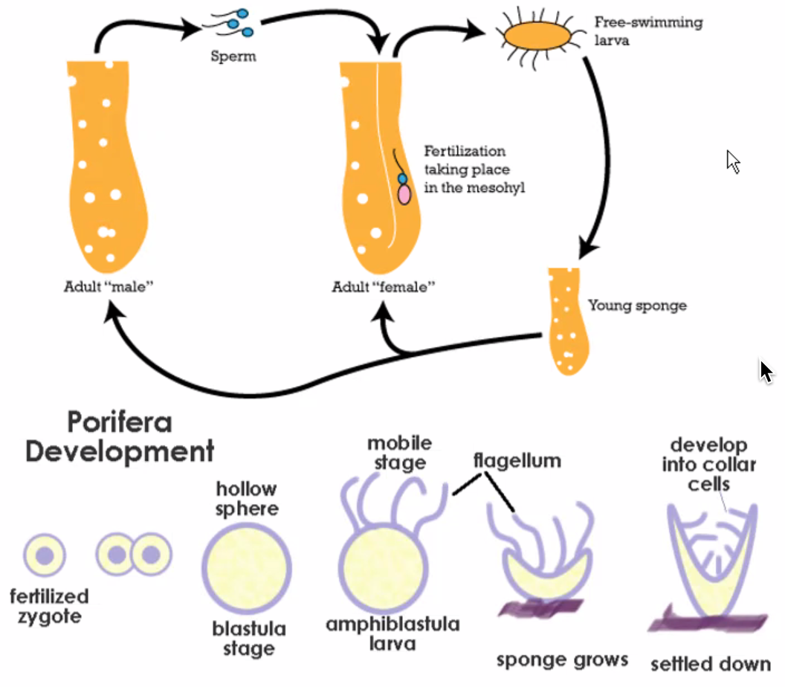

## Definition

1. All animals are heterotrophs with almost all being ingestive.
2. Multicellular
3. Utilize collagen as a structural material.
4. Unique cells such as nerve and muscle cells.
5. Diploid dominant

## Development

Zygote undergoes cleavage and turns into a **morula**
: a solid ball of cells

which continues to dividie into a **blastula**
: a hollow ball of cells

a part of the blastula pinches inwards during gastrulation to form the archenteron where true tissues start to form.

Germ layers are developed during gastrulation
formation of true tissues:

1. Ectoderm
   : Found at the outermost layer and gives rise to skin and nerves.
2. Mesoderm
   : Found in between the ectoderm and endoderm and usually gives rise to muscle cells.
3. Endoderm
   : Lines the digestive tract and gives rise to organs that surround the digestive tract.

**Diploblastic**
: Usually more primitive animals which only have ectoderm and endoderm.

**Triploblastic**
: Have all three germ layers

**Coelom**
: Internal body cavity usually filled with air or liquid that doesn't have access to the outside environment.

**Acoelomate**
: No body cavity. These animals are usually very flat.

**Pseudocoelomate**
: Body cavity that is surrounded by mesoderm and endoderm.

**Coelomate**
: Body cavity surrounded only by mesoderm.

**Protostome**

- Spiral cleavage
- Determinate cleavage
  : Each cell is already destined to be a particular cell.

**Deuterostome**

- Radial cleavage
- Indeterminate cleavage
  - Each cell still has the capacity to turn into any type of cell.
- Mesoderm buds off of the archteron and second opening becomes the mouth.

### History

750 mya
: Choanoflagellates are the protists that likely gave rise to the first animals.

540 mya
: Cambrian explosion gave rise to most bilateral animals.

450 mya
: Arthropods are likely the first animals to colonize land.

**Ancestral traits** are shared by a group of organisms that all share the same ancestral lineage while **derived traits** are a unique trait spcefic to a particular group of organism

**Radial symmetry**
: A round organism that produces mirror halves when bisected from any plane.

**Bilateral symmetry**
: Only one plane which results in mirror halves.
: Usually more active

**Cephalization**
: Development of a head.

## Phylums

### Porifera

#### Anatomy

Many pores that lead into the

#### Definitions

**Asconoid**
: Pores lead directly ino the spongocoel.

**Syconoid**
: Sponge walls have subchambers that the prose lead into before entering the spongocoel.

**Leuconoid**
: Sponge walls have subchambers within subchambers and no clear osculum.

#### Lifecycle

### Cnidaria

Jellyfish, hydras, anemones, and corals.

#### Characteristics

- Diploblastic
- Gastrovascular cavity (closed gut) single opening that functions as both mouth and anus.
- Can alternate between a polyp and medusa form.

Polyp
: Sessile (anchored to a substrate) with tentacles and muth pointed upwards.

Medusa
: Planktonic (free floating or swimming in open water)

#### Classes

Some polyps are reproductive polyps that contain a stack of medusas, the medusas pop off and swim in water and release their gametes. Fertilization occurs in water and the fertilized zygote will remain dormant until environmental conditions are suitable. The zygote will develop into a free swimming larva called the planulua swims and anchors itself to develop into a new hydra

Portuguese Man o War
: Colonial hydra that's made up of multiple different specius but functions as a whole animal

##### Scyphozoa

- Jellyfishes
- Medusa dominant
- Some can still turn into a polyp

##### Cubozoa

- Box jellyfish
- Contains fringes coming out of the bell that contains its tentacles
- There are eyes around the fringes
- Have the most powerful venom of all animals

##### Anthozoa

All members are polyp dominant

Includes

- Corals
- Sea anemones

Both members also have symbiotic interactions with other organisms.

Corals form a large calcium carbonate skeleton that makes the foundation of their structures. Only living parts of a coral are at the surface.

Corals have a mutualism with dinoflagellates (zooxanthellae)

Sea anemone have a mutualism with clownfish. The sea anemone provides shelter to the clownfish and the clownfish cleans parasites off of the anemone.

### Ctenophora

- Comb jellies
- 8 rows of cilia used to swim
- Don't have nematocysts, instead they have sticky cells called colloblasts
- Often bioluminescent
