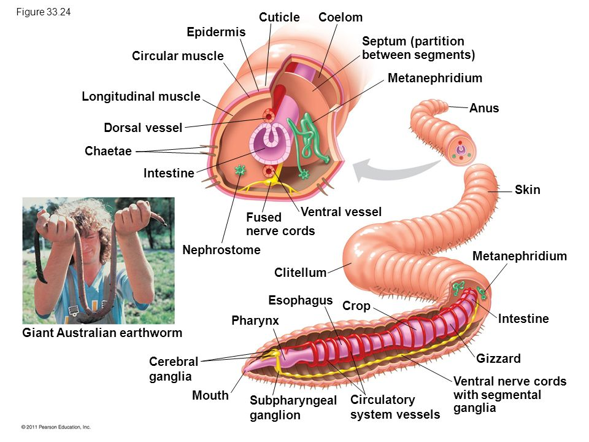
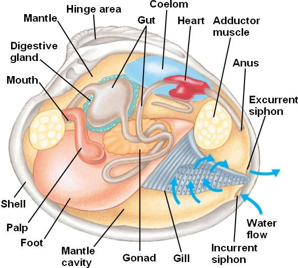
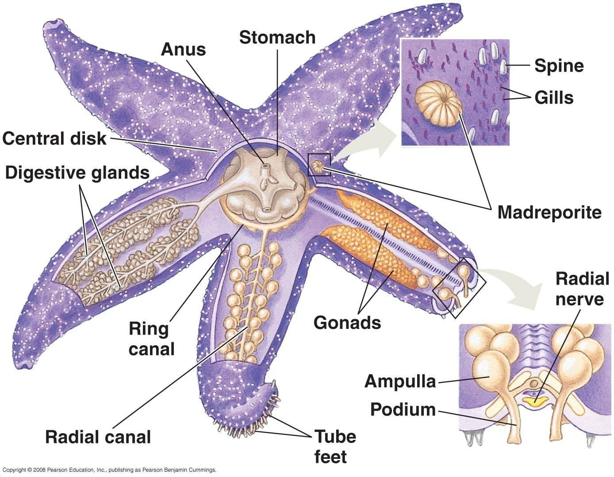

<!-- prettier-ignore -->
!!! note 
    All members either have a lophophore feeding structure (ciliated filter
    feeders) or a trochophore larva

### Polychaeta

-   Mostly marine worms
-   Most diverse members of the annelid worms
-   Have particularly pronounced setae.
-   Have a pair of parapodia on each segment that functions as gills and
    contains setae

### Class Clitellata

-   Includes the earthworms and leeches
-   Have a reproductive structure called the clitellum
-   The clitellum is a smooth cocoon-like structure that contains the
    reproductive organs of the organism
-   Members are hermaphrodites

#### Subclass Oligochaeta

-   Earthworm
-   Soil dwellers that filter soil through their intestines and absorb nutrients
    from there
-   They help recycle nutrients and loosen up soil
-   Have a closed circulatory system with 5 hearts

<figure markdown> 
  
  <figcaption>Oligochaeta Anatomy</figcaption>
</figure>

#### Subclass Hirudinea

-   Leeches
-   Most members are predators that feed on other small invertebrates
-   Some are blood parasites
-   Parasites have two suckers and they usually have jaws that slice open the
    skin and release digestive enzymes to burn a hole through and drink blood
-   They release an anesthetic and also hirudin which is an anti-bloodclotting
    agent

### Phylum Ectoprocta

-   Form large colonies that are covered in a chitin exoskeleton
-   Use lophophores to filter feed
-   Very common

### Phylum Brachipoda

-   Have 2 shell halves that resemble a bivalve and contain the lophophore
    inside
-   Have a stalk at the base of the shell that anchors themselves to the
    substrate
-   Example of a living fossil

### Phylum Mollusca

-   Second most diverse phylum of animals
-   Includes soft bodied animals that have a three part body plan
    1. Muscular foot
        - Used for movement
    2. Visceral mass
        - Contains all of the vital organs
    3. Mantle
        - Creates the calcium carbonate shell
-   Most members have an open circulatory system (cephalopods are an exception)
-   Most use gills for respiration and some terrestrial members use lungs
-   Some grazing members have a radula mouthpart that is specialized for grazing

#### Class Polyplacophora

-   Known as the Chitins
-   Dorsal ventrally flattened slug-like body with exactly 8 dorsal plates
-   Specialized at grazing algae

#### Class Gastropoda

-   Includes the snails and slugs
-   Snails have their visceral mass inside the shells but the slugs have lost
    their shells
-   These organisms are called "stomach-foot"
-   Have tentacles that contain their eyes
-   During development, members will undergo torsion where their visceral mass
    is rotatetd along the axis of their foot resulting in their anus next to
    their gills

#### Class Bivalvia

-   Includes clams, scallops, muscles, and oysters
-   They have two shell halves that contain all their visceral mass
-   Their foot is hidden inside
-   Filter feeders but they are not sessile
-   Can still move to some degree but mostly to avoid predators
-   They have two adductor muscles that hold together the two shell halves
-   They use two siphons to filter water for food
-   Larva are often blood parasites that latch onto fish gills
-   Larva get "free" resources from the host
-   The larva hitch a ride from the fish so they can be dispersed

<figure markdown> 
  
  <figcaption>Bivalvia Anatomy</figcaption>
</figure>

#### Class Scaphopoda

-   "Tusk foot"
-   Resemble a snail with a very long shell
-   Filter feeders that have an opening on both ends of the shell
-   Uses a siphon to draw water into the body and filter feed

#### Class Cephalopoda

-   "Head foot"
-   Members have an extremely large head
-   Their foot has been modified into tentacles
-   Members include octopus, squid, nautilus, and cuttlefish
-   All members are predatory

Clade Deuterostomia - radial and indeterminate cleavage, mesoderm buds off of
the archenteron, first opening is the anus

### Phylum Echinodermata

-   Pentaradial (technically still bilateral)
-   Have tough skin made of calcium carbonate
-   Use a water vascular system for movement and circulation
-   Five rows of tube feet for movement

#### Class Asteroidea

-   Starfish/sea stars
-   Have five radiating arms from a central disk and are slow moving predators
    that use their tube feet to trap prey
-   Water vascular system
    -   Water is drawn through the madreporite into the ring canal and
        eventually travels through the radial canal into the ampulla, which are
        muscualr bulbs that contract and excrete water into the tube foot and
        extends it out
    -   The tip of the tube feet have an adhesive that allows them to stick
-   It feeds by regurgitating its stomach to cover its food and dissolve it
-   Slurps up the food and the stomach back into the mouth

<figure markdown>
  
  <figcaption>Asteroidea Anatomy</figcaption>
</figure>

#### Class Ophiuroidea

-   Includes the brittle stars and basket stars
-   Look similar to starfish but they have thinner but longer arms that use a
    whip-like motion for movement
-   Mostly bottom dwellers scavengers or predators

#### Class Echinoidea

-   Includes sand dollars and sea urchins
-   Sea urchins have long spines around their bodies that they use for defense
-   All members have a specialized mouth part called "Aristotle's Lantern"
    designed for eating kelp

#### Class Crinoidea

-   Sea lilies and feather stars
-   Most are either sessile or planktonic and all members are filter feeders
-   Some are considered living fossils

#### Class Holothuroidea

-   Sea cucumbers
-   Have a much more elongated body but they do still retain the five rows of
    tube feet
-   Filter feeders
-   Hide their bodies under the sea floor and release filter feeding mouth parts
