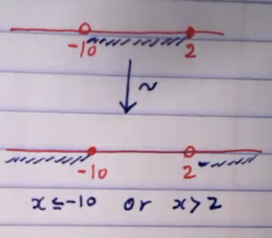

## Introduction

Two compound propositions P and Q are said to be logically equivalent if their truth tables are the same.

> Note that in this case the biconditional implications $p \leftrightarrow q$ is a tautology, and we write $p \Leftrightarrow q$

<u>Ex</u>: show that the following are logically equivalent

1. $p \to q \equiv \lnot p \lor q$

| p   | q   | $p \to q$ |
| --- | --- | --------- |
| T   | T   | T         |
| T   | F   | F         |
| F   | T   | T         |
| F   | F   | T         |

| p   | q   | $\lnot p$ | $\lnot p \lor q$ |
| --- | --- | --------- | ---------------- |
| T   | T   | F         | T                |
| T   | F   | F         | F                |
| F   | T   | T         | T                |
| F   | F   | T         | T                |

: T F T T - logically equivalent

---

2. $p \to q \equiv \lnot q \to \lnot p$

| p   | q   | $p \to q$ | $\lnot q$ | $\lnot p$ | $\lnot q \to \lnot p$ |
| --- | --- | --------- | --------- | --------- | --------------------- |
| T   | T   | T         | F         | F         | T                     |
| T   | F   | F         | T         | F         | F                     |
| F   | T   | T         | F         | T         | T                     |
| F   | F   | T         | T         | T         | T                     |

: T F T T - logically equivalent

---

## Properties

Suppose $p,q,r,...$ are given propositions. Then

1. **Commutative Property**
   : $p \lor q \equiv q \lor p$, $p \land q \equiv q \land p$
2. **Associative Property**
   : $p \lor (q \lor r) \equiv (p \lor q) \lor r$
   : $p \land (q \land r) \equiv (p \land q) \land r$
3. **Distributive Property**
   : $p \land (q \lor r) \equiv (p \land q) \lor (p \land r)$
   : $p \lor (q \land r) \equiv (p \lor q) \land (p \lor r)$
4. **Negation of Negation**
   : $\lnot (\lnot p) \equiv p$
5. **DeMorgan's Laws**
   : $\lnot (p \lor q) \equiv \lnot p \land \lnot q$
   : $\lnot (p \land q) \equiv \lnot p \lor \lnot q$
6. **Contrapositive Law**
   : $p \to q \equiv \lnot q \to \lnot p$
7. **Cumulative**
   : $p \to q \equiv \lnot p \lor q$
   : $\lnot (p \to q) \equiv p \land \lnot q$
8. **Idenpotent Law**
   : $p \lor p \equiv p$, $p \land p \equiv p$

---

<u>Ex</u>: Find the negation of each statement

1. John <u>is a math major</u> <b>and</b> John's brother is a <u>computer science major</u>
   : $\lnot (p \land q) = ?$
   : by DeMorgan's Law $\lnot (p \land q) \equiv \lnot p \lor \lnot q$
   : John is not a math major or John's brother is not a computer science major
2. The units digit of $4^{67}$ is 4 or it is 6
   : $\lnot (p \lor q) = ?$
   : By DeMorgan's law $\lnot (p \lor q) \equiv \lnot p \land \lnot q$
   : The units digit of $4^{67}$ is not 4 and it is not 6
3. $-10 < x \leq 2$
   : $p: -10<x$
   : $q: -10 \leq 2$
   : 
   : $p: x \leq -10$
   : $q: x \gt 2$
   : $\lnot (p \land q) = ?$
   : by DeMorgan's law $\lnot (p \land q) \equiv \lnot p \lor \lnot q$
   : $\lnot (-10 \lt x \leq 2) \equiv (x \leq -10) \lor (x \gt 2)$
4. If I pass math 245, then I graduate
   : $\lnot (p \to q)=?$
   : Note that $\lnot(p \to q) \equiv p \land \lnot q$
   : I pass math 245 and I don't graduate

---

## Contrapositives, Converses, and Inverses

1. The <u>contrapositive</u> of $p \to q$ is $\lnot q \to \lnot p$
2. The <u>converse</u> of $p \to q$ is $q \to p$
3. The <u>inverse</u> of $p \to q$ is $\lnot p \to \lnot q$

<u>Ex</u>: write the contrapositive, converse, and inverse of the statement

> If n ends in a digit 2, then n is divisible by 2

The contrapositive of $p \to q$ is $\lnot q \to \lnot p$

> If n is not divisible by 2 then n does not end in a digit 2

The converse of $p \to q$ is $q \to p$

> If n is divisible by 2, then n ends in a digit 2

The inverse of $p \to q$ is $\lnot p \to \lnot q$

> If n does not end in a digit 2, then n is not divisible by 2
