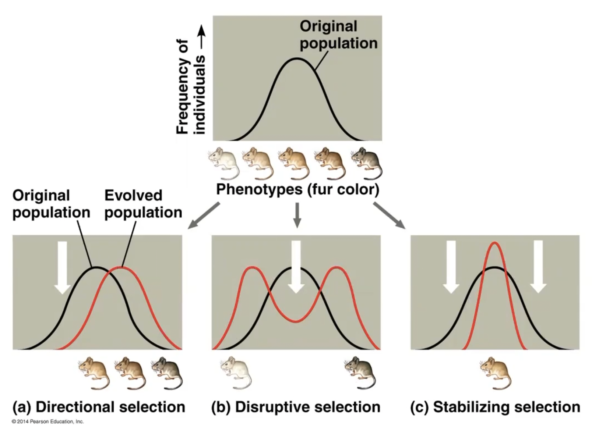

## Speciation

: A group of populations whose members have the potential to interbreed in nature and produce viable, fertile offspring; they do not breed successfully with members of other populations

**Reproductive isolation**
: The existence of biological factors that impede two species from producing viable, fertile offspring.

### Reproductive barriers

: Prevents two species from interbreeding successfully

#### Prezygotic

- Habitat isolation
  : Species occupy different habitats
- Temporal isolation
  : Species breed at different times of the day, seasons, or years
- Behavioral isolation
  : Courtship rituals and other unique behaviors
- Mechanical isolation
  : Morphological differences
- Gametic isolation
  : Sperm of one species may not be able to fertilize eggs of another

#### Postzygotic

- Reduced hybrid viability
  : Genes of the different parent species may interact and impair the hybrid's development or survival in its environment
- Reduced hybrid fertility
  : Hybrids may be sterile
  : Donkey + Horse = Mule (sterile)
- Hybrid breakdown
  : Some first-generation hybrids are fertile, but when they mate with each other or with either parent species, offspring of the next generation are feeble or sterile.

## Genetic Variation

Caused by differences in genes or other DNA segments.
Important for producing adaptations in a changing environment.

**Gregor Mendel**
: Proved existence of genes using pea plants

### Mutations

: Gene duplication
: Deceasing generation time (more cell division)

### Sexual reproduction

: Shuffles existing alleles into new combinations
: More important for adaptations than mutation in sexually reproducing organisms

---

### Hardy-Weinberg Equation

: Tests if a population is evolving.

$p^2+2pq+q^2=1$
: If equal to 1 then population is **not** evolving

Five conditions for non-evolving populations

1. No mutations
2. Random mating
3. No natural selection
4. Extremely large population size
5. No gene flow

---

### Genetic drift

**Founder effect**
: Occurs when a small subset of a population emmigrates and thus decreases the gene pool

**Bottleneck effect**
: Some event reduces the population size which reduces the gene pool

### Gene flow

: Transfer of genetic material from one population to another.

**Genetic pollution**
: occurs when the genetic material of one population (immigrants) have traits that are not adaptable to the new population

#### Natural selection

Not random and consistently results in adaptations

**Directional**
: Favors towards one extreme.

**Disruptive**
: Favors both extremes

**Stabilizing**
: Favors average

- Speciation
  - Allopatric
    - Geographically isolated populations
    - Each population has their own mutations
  - Sympatric
    - Geographically overlapping
    - Habitat differentiation
      - Focus on different resources
    - Sexual selection
      - Certain sexual preferences
- How is the fossil record biased?
  - Soft bodied organisms don't leave a trace
  - Rare organisms likely not preserved / low chance of being found

| Time    | Description                                                                                                                                                                                                                                                     |
| ------- | --------------------------------------------------------------------------------------------------------------------------------------------------------------------------------------------------------------------------------------------------------------- |
| 3.5 bya | the oldest fossil record which were bacterial mats - origin of prokaryotes                                                                                                                                                                                      |
| 1.8 bya | origin of eukaryotes                                                                                                                                                                                                                                            |
| 1.2 bya | origin of multicellular organisms - all cells need some way to adhere to each other, cells need to be able to communicate with one another and function as a whole                                                                                              |
| 540 mya | cambrian explosion - huge explosion of organismal diversity including many organisms that resemble organisms in modern days                                                                                                                                     |
| 488 mya | life moved on to land - with the exception of bacteria plants and fungi likely moved onto land first                                                                                                                                                            |
| 250 mya | permian extinction - caused by a lot of volcanic eruptions which polluted the atmosphere, very toxic gasses accumulated such as methane, hyrdogen sulfide, and $CO_2$ - approximately 96% of life went extinct (mostly marine life)                             |
| 65 mya  | cretaceous extinction - wiped out the dinosaurs - a large meteorite hit the planet - the impact wiped out a large amount of life, but the aftermath where a lot of debris blocked off sunlight led the global climate changes - this led to the mass extinction |

- Endosymbiont theory - origin of eukaryotic organelles is likely where a larger eukaryotic cell engulfed a smaller prokaryote and the prokaryote became a mutual simbiote permanently living inside
- After extinction events, you see adaptive radiation - following an extinction event, usually there's a huge explosion of diversity because the survivors have no competition, and they continue to diversify and specialize
  - 5 major extinction events - are we in a 6th?
- Systematics is the study of the historical diversity of life and how theyre related
