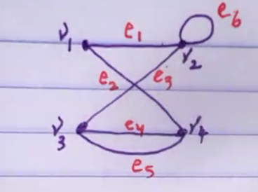
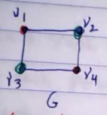
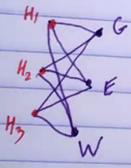

## The Handshaking Theorem

> The sum of the degrees of the vertices of a graph is equla to twice the number of edges

If $G$ is a graph with $n$ vertices $V_1, V_2, ..., V_n$ then $$\sum_{i=1}^{n} deg V_i = deg V_1 + deg V_2 + ... deg V_n = 2E $$ where $E$ is the total number of edges.

> Note that a loop is counted twice towards the degree of its endpoint vertex.

<u>Remark</u>:

1. The sum of degrees in any graph is even.
2. The number of vertices with odd degrees in a graph is even.

<u>Proof</u>

1. If $G$ is a graph with $n$ vertices $V_1, V_2, ..., V_n$ then

: $$\sum_{i=1}^{n} deg V_i = 2E$$

: where $E$ is the total number of edges.

2. Suppose $V_1, V_2, ..., V_k$ are vertices with odd degrees. Then $(deg V_1 = deg V_2+...+deg V_k) + (deg V_{k+1} + ... + deg V_n) = 2E$

### Examples

- [ ] Is there a graph with ten vertices of degrees $1,1,2,2,2,3,4,4,4,6$

: $\sum deg V = 1+1+2+2+2+3+4+4+4+6 = 29$
: 29 is an odd number so this is not a graph.

- [ ] In a graph of 15 people, is it possible for each person to have exactly 3 friends? Explain.

: $$\sum_{i=1}^{15} deg V_i = 3+3+3+...+3=45$$
: 45 is an odd number so this is not a graph.

TODO:

- k_1 - k_5 graphs

<u>Remark</u>

1. The degree of each vertex of $K_n$ is $(n-1)$.
2. There are $\frac{n(n-1)}{2}$ edges in $K_n$. So $E=\frac{n(n-1)}{2}$
3. $\chi (K_n)=n$
   : Each vertex is connected to every other vertex.

## Bipartite Graphs

Suppose $G$ is a graph and $V$ is its vertices set, such that there are two subsets $V_1$ and $V_2$ with
: $V_1\cup V_2=V$, $V_1\cap V_2=\varnothing$
: If no two vertices in $V_1$ or in $V_2$ are adjacent, then $G$ is called a bipartite graph.

### Examples

1. The follwinig
   : 
   : $V_1=\{V_1,V_4\}$, $V_2=\{V_2,V_3\}$
   : $V=V_1\cup V_2$, $V_1\cap V_2=\varnothing$

is complete if each vertex in $V_1$ is adjacent

### Examples

$K_1,3$
:

$K_2,2$
: 

$K_3,2$
: 

$K_3,3$
: 

Suppose $x$ is even and $y$ is odd

$$
\begin{aligned}
&f k_{1}: x=2 k_{1} \\
&\exists k_{2}: x=2 k_{2}+1 \\
&\Rightarrow x y=2 \underbrace{K_{1}\left(2 K_{2}+1\right)}_{k}=2 k
\end{aligned}
$$
