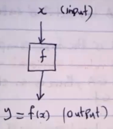

## Sets

A set A is any well-defined (related) list or collection of objects

- Sets are denoted by $A,B,X,Y,...$
- The objects of the set are called its members or elements and are denoted by $a,b,x,y,...$

<u>Ex</u>: (special sets)

1. Counting numbers or natural numbers set
   : $N=\{1,2,3,4,...\}$
2. Integers
   : $Z=\{...,-2,-1,0,1,2,3,...\}$
3. Positive integers
   : $Z^+=\{1,2,3,4,...\}=N$
4. Rational Numbers
   : $Q=\{\frac{a}{b},\textrm{a and b are integers with b} \neq 0\}$
5. Real numbers
   : $R=-\infty \leq x \leq \infty$
6. Complex numbers
   : $C$

### Notations

- If $x$ is an element of the set $A$, we write
  : $x \in A$: "x belongs to A"

- If $x$ is not an element of the set $A$, we write
  : $x \notin A$: "x does not belong to A"

- If the sets $A$ and $B$ have the same members, then we write $A=B$
  : $A=B \Leftrightarrow$ for any $x\in{A}\Rightarrow x\in B$
  : A is equivalent to B if and only if for any member x in set A implies x is in set B

- If a set $A$ has no element then $A$ is called an <u>empty set</u>. In this case we write
  : $A=\varnothing$ or $A=\{\}$
  : Note that $\{\varnothing\}$ is not an empty set

- The members of all possible sets under investigation belong to some fixed largest set called the <u>universal set</u>
  : It is denoted by $U$

#### Subsets

- If $A$ and $B$ are given sets, then $B$ is a subset of $A$ if every element in $B$ is also an element of $A$
  : We write $B\subseteq A$ so
  : $B\subseteq\Leftrightarrow$ for every $x\in B \Rightarrow x\in A$
  : - Note that if $B \neq A$ and $B$ is a subset of $A$, then $B$ is a proper subset of $A$ and we write $B \subset A$

<u>Ex</u>:
Suppose $A=\{1,,3,4,5,8,9\}, B=\{1,2,3,5,7\}$ and $C=\{1,5\}$ then
: $C \subset A$, $C \subset B$, $B \subsetneq A$

---

## Cartesian Products

If the sets $A$ and $B$ are given, then the cartesian product (or cross product) of $A$ and $B$ is denoted by
: $A \times B$ and is defined by $A \times B=\{(a,b):a \in A \textrm{ and } b \in B\}$

The elements $(a,b)$ in $A \times B$ are called <u>ordered pairs</u> of $A$ and $B$.
: Note that if $A$ has $m$ elements and $B$ has $n$ elements, then $A \times B$ has $mn$ elements.

<u>Ex</u>:
Suppose $A=\{2,3,4\}$ and $B=\{4,5\}$ find the following sets

1. $A \times B$
   : $A \times B$ has $3 \times 2=6$ elements
   : $A \times B=\{(2,4),(2,5),(3,4),(3,5),(4,4),(4,5)\}$

2. $B \times A$
   : $B \times A$ has $2 \times 3=6$ elements
   : $A \times B=\{(4,2),(5,2),(4,3),(5,3),(4,4),(5,4)\}$

3. $B \times B$
   : $B \times B$ has $2 \times 2=4$ elements
   : $B \times B=\{(4,4),(4,5),(5,5),(5,4)\}$

---

## Relations

If $A$ and B are given sets, then a relation $R$ from $A$ to $B$ is a subset of $A \times B$.
: In this case, $A$ is the domain of $R$ and $B$ is the co-domain of $R$.

<u>Ex</u>:
Suppose $A=\{2,3,4\}$ and $B=\{4,5\}$, then the following are relations from $A$ to $B$.

1. $\{(2,4),(3,4),(4,4)\}$
   : All members of $A$ related to 4

2. $\{(2,4),(3,4),(4,5),(3,5)\}$
   : Cannot be a function because 3 appears as first component twice

3. $\{(2,4),(3,5)\}$
   : All members of $A$ are not covered

4. $A \times B$
5. $\varnothing$

### Relation Notation

If $R$ is a relation from $A$ to $B$ then
: Given $(x,y) \in A \times B$, we write $xRy \Leftrightarrow (x,y) \in R$
: For example if $R=\{(2,4),(3,4),(4,4)\}$, then $2R4, 3R4,$ but $2\cancel{R}5$.

<u>Ex</u>:
Suppose $A=\{1,2\}$ and $B=\{1,2,3\}$ and a relation from $A$ to $B$ is defined by:
: Given $(x,y)\in A \times B$, then $xRy \Leftrightarrow \frac{x-y}{2}$ is an integer.
: Identify all members of the relation $R$

> Note that $A \times B$ has $2 \times 3=6$ elements

: $A \times B=\{(1,1),(1,2),(1,3),(2,1),(2,2),(2,3)\}$

- [x] $(1,1) \in A \times B, \frac{x-y}{2}=\frac{1-1}{2}=\frac{0}{2}=0$
- [ ] $(1,2) = -\frac{1}{2}$
- [x] $(1,3) = -\frac{2}{2}=-1$
- [ ] $(2,1) = \frac{1}{2}$
- [x] $(2,2) = 0$
- [ ] $(2,3) = -\frac{1}{2}$

$R=\{(1,1),(1,3),(2,2)\}$

domain$(R)=A$

co-domain$(R)=B$

---

## Functions and Relations

A relation $f$ from a set $A$ to a set $B$ is called a function if

1. Every element of $A$ is the first component of an ordered pair of $f$ (The function $f$ covers all members of $A$) or for any given $x \in A$, there is an element $y \in B$ such that $(x,y) \in f$.

2. No two distinct ordered pairs in $f$ have the same first component. (ordered pairs in $f$ cannot have the same first component).

> Therefore, a relation $f: A \to B$ is a function if it relates every element of $A$ to exactly one element of $B$.

<u>Ex</u>:
Suppose $A=\{4,5,6\}$ and $B=\{5,6,7\}$. Determine if the given relation is a function. If not, justify your answer.

1. $T=\{(4,7),(5,5),(6,7)\}$
   : $T$ is a function.

2. $R=\{(5,5),(6,6),(6,5),(4,5)\}$
   : $R$ is not a function because $(6,6)$ and $(6,5)$ have the same first component.

3. $S=\{(5,6),(6,7)\}$
   : $S$ is not a function because 4 is in $A$ but is not covered.

### Function Notation (Function Machines)

Suppose $f: A \to B$ is a given function, then $f$ relates each element $x$ in $A$ to exactly one element $f(x)$ in $B$. We write $y=f(x)$ as the equation of the function.

: The set of all inputs ($x$-values) is the <u>domain</u> of the function of $f$ (which is $A$) and the set of all outputs ($y$-values) is the <u>range</u>
: The co-domain is the set of values that could possibly come out. The co-domain is actually part of the definition of the function.
: The range is the set of values that actually do come out.

<u>Ex</u>:

1. $f(x)=3x+1$ is a function.
2. $x=y^2$, then $y$ is not a function of $x$.
   : $(1,1), (1,-1)$ have the same first component.

<u>Ex</u>:
Suppose $x=\{a,b,c\}$ and $y=\{1,2,3,4\}$
If a function $f: x \to y$ is defined by $f=\{(a,2),(b,4),(c,2)\}$

1. Find $f(a), f(b),$ and $f(c)$.
   : $f(a)=2$
   : $f(b)=4$
   : $f(c)=2$

2. Write the domain and the co-domain of $f$
   : The domain is $x$
   : The co-domain is $y$

3. What is the range of $f$.
   : $\textrm{Range}(f)=\{2,4\}$
